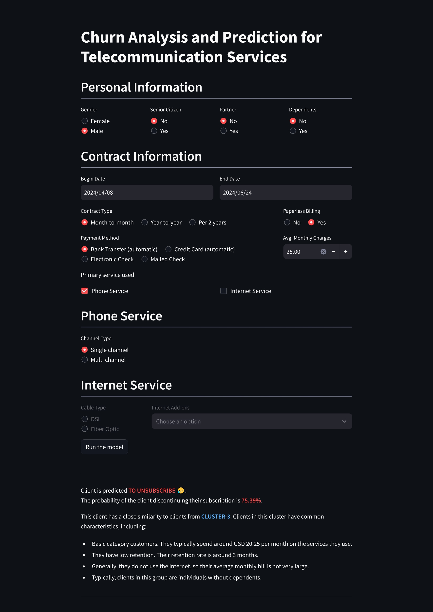
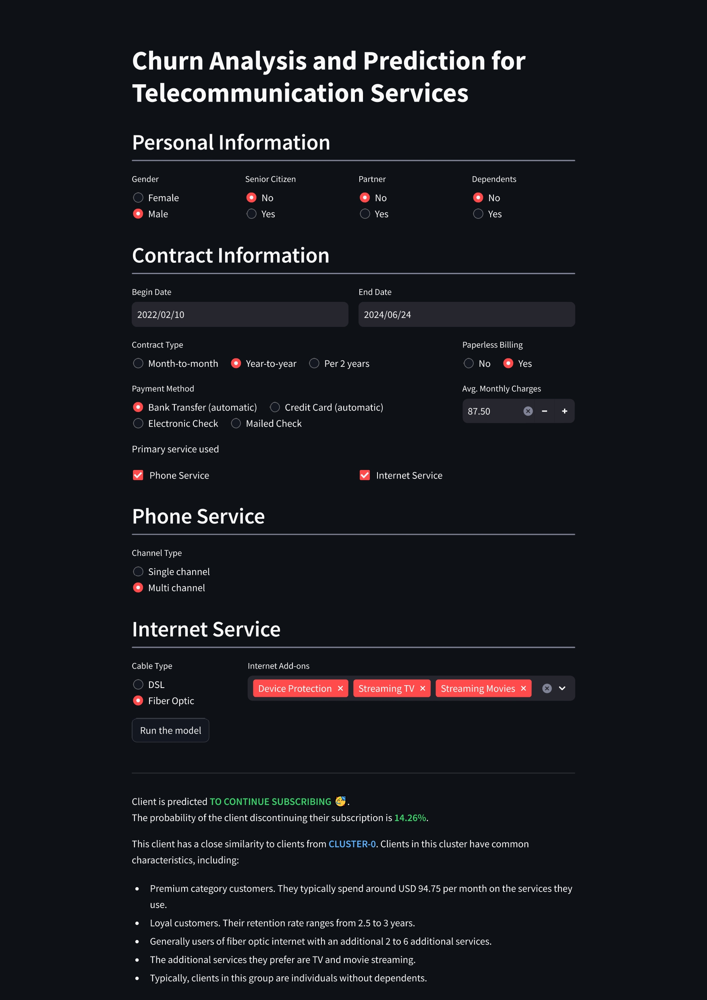
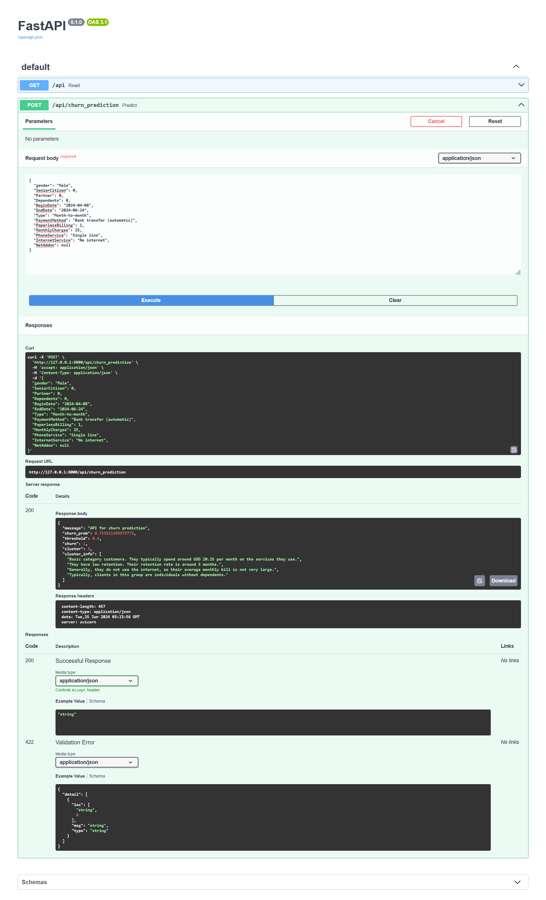
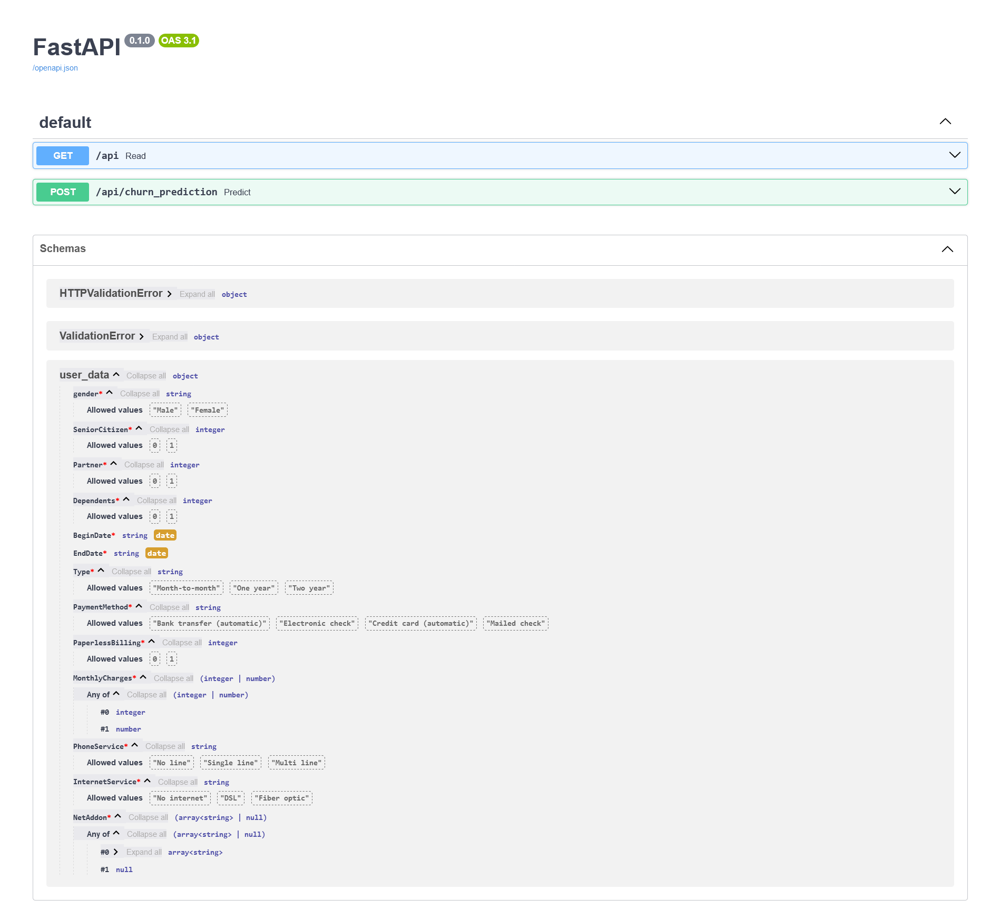

#  **Churn Analysis and Prediction for Telecommunication Services:** Proactive strategies to improve customer retention in telecommunications services.

***

## **About the Project**
### Background and Objectives

 

A telecommunications company named **Interconnect** wants to improve customer retention by offering promotional codes and special package options. To ensure the promotions are targeted effectively, the company needs to identify clients who are likely to unsubscribe soon. Therefore, this project aims to develop a predictive model that can forecast whether a client will unsubscribe based on collected information.

The processes involved in this project include:
* Conducting data analysis.
* Building a machine learning model.
* Deploying the model on `Streamlit` and `API`.

Here is the user interface (UI) of the deployed model on `Streamlit`: [Click here](https://telecomunication-customer-retention-predictor.streamlit.app/)

### Results Interpretation
The output of this project includes a clustering model and a predictive model for predicting churn. The clustering model provides information about which group a client belongs to and their characteristics. The predictive model for churn prediction indicates whether a client has unsubscribed based on the information fed into the model.

## **Model Building**
In this project, three algorithms were optimized:
* `Logistic regression`
* `Random Forest Classifier`
* `Gradient Boosting Classifier`

Among these models, the best-performing model is the **`Gradient Boosting Classifier`** with a ROC-AUC score of 0.92 on the validation set and 0.91 on the testing set.

## **Model Deployment**
In this project, the model can be used via `Streamlit` and `API`. On `Streamlit`, the model is accessible through an attractive and user-friendly interface. Through the `API`, the model can be utilized for other program development needs that require the ability to predict churn rates in telecommunications services.

### Streamlit
The model deployed on `Streamlit` can be accessed publicly through the following link ([Click here](https://telecomunication-customer-retention-predictor.streamlit.app/)).
 Below is a snapshot showing how the model on `Streamlit` is used to predict churn rates and perform cluster analysis.

    
    

### RESTful API
The model deployed on the API is located in the file `./deployment/fast_api/restful_api.py`. To use the API locally, run `uvicorn deployment.fast_api.restful_api:app` in your terminal. A tutorial on how to use the API can be found in the notebook `./deployment/fast_api/HowToUse.ipynb` for use with Jupyter Notebook.

Below is a snapshot of the model prediction via API: 

The requirements for how data should be input for each parameter can be found in the **`Schemas > user_data`** section, as shown in the following image.

