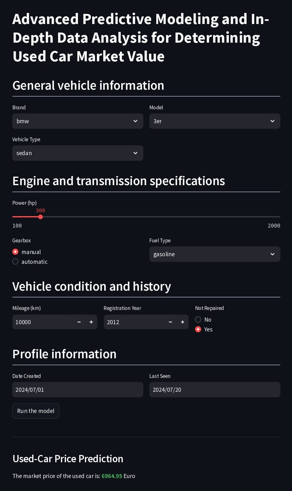

#  **Advanced Predictive Modeling and In-Depth Data Analysis for Determining Used Car Market Value:** Analyzing the impact of vehicle brand, vehicle type, fuel type, transmission type, and other parameters on used car prices.

***

# **About the Project**
## Background and Objectives

 

The **Rusty Bargain** company operates in the buying and selling of used cars. Currently, the company is developing an application to attract new buyers. One of the features they want to include in the application is a feature that can accurately and quickly provide market prices for used cars. Therefore, the company has asked us to create this feature using machine learning. The company has also provided the necessary data to develop the model, such as vehicle technical specifications, vehicle model versions, and vehicle sales price history. There are three important points to consider when building this model: model accuracy, prediction speed, and the time required to train the model.

The processes involved in this project include:
* Processing data to prepare model input features.
* Conducting exploratory data analysis and data visualization.
* Building the machine learning model.
* Deploying the model on `Streamlit`.

## Results Interpretation
The output of this project is a predictive model for forecasting market prices of used cars, analysis results of how various features affect used car prices, and a web-based model interface using `Streamlit` that can be accessed through the following link: [Click here](https://used-car-market-price-predictor.streamlit.app/)

# **Project Outcome**
## Exploratory Data Analysis (EDA)
* The typical price of used cars sold on the platform is around 5000 Euros. The engine capacity of these cars is approximately 140 hp. Most of the used cars on this platform have a mileage of 125,000 - 150,000 km. The typical age of used vehicles sold is 12 years. The typical period for which a post remains actively monitored by the owner is 7 days after publication.
* **Top 5** brands of used cars with the highest prices are **Porsche**, **Mini**, **Land Rover**, **Dacia**, and **Smart**.
* **Top 3** types of used cars with the highest prices are **SUV**, **Convertible**, and **Coupe**.
* **Top 3** types of used cars based on fuel type with the highest prices are **Hybrid**, **Gasoline**, and **Electric**.
* Cars with **automatic** transmission have higher prices compared to **manual** transmission cars.
* The variables `'Power'`, `'Mileage'`, and `'car_age'` show a strong correlation with the variable `'Price'` compared to other variables. Older cars and those with higher mileage will result in lower sale prices. Conversely, cars with higher engine power will have higher sale prices.

## Model Development
* The models ranked by shortest training duration are as follows: Linear Regression (8-10 seconds), XGBoost Regressor (122-129 seconds), and Random Forest Regressor (183-190 seconds).
* The models ranked by shortest prediction duration are: Linear Regression, XGBoost Regressor, and Random Forest Regressor.
* MAE scores for the model when predicting the testing set are:
    * Linear Regression: 1889.11 Euro
    * Random Forest Regressor: 1137.63 Euro
    * XGBoost Regressor: 1124.66 Euro
      

 
* Based on MAE scores, training and prediction times, the best model for predicting used car prices is the **XGBoost Regressor**.

# **Model Deployment**
In this project, the model can be used via `Streamlit`, which features an attractive and user-friendly interface. The deployed model can be accessed through the following link ([Click here](https://used-car-market-price-predictor.streamlit.app/)).
 Here is a screenshot showing how the model is used on `Streamlit` to predict the market price of a used car.

    

