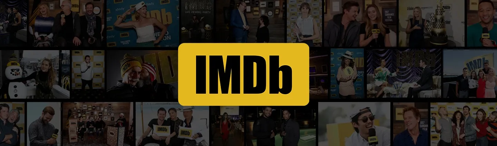
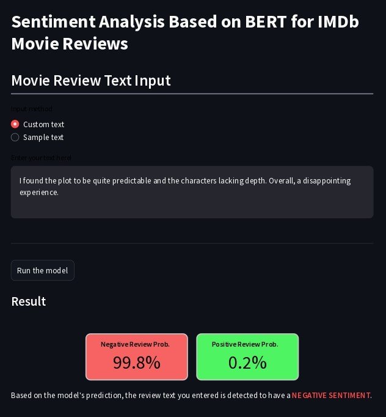
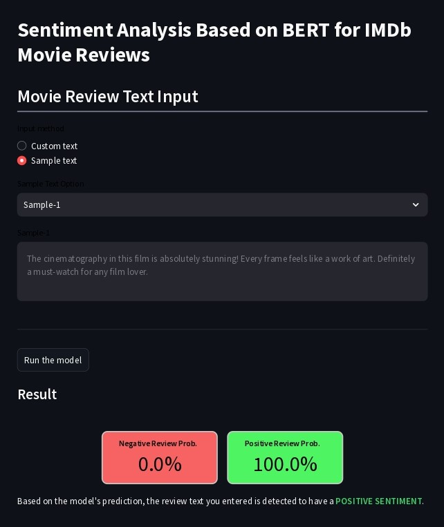

    

        
    

    

        
<b>Sentiment Analysis Based on BERT for IMDb Movie Reviews:</b>

        
Revealing Sentimental Insights of Movie Fans.

    

***

# **About the Project**
## Background and Objectives

 

Currently, we are working for **Film Junky Union**. **Film Junky Union** is a new community for classic movie enthusiasts. The community wants to develop a system to filter and categorize movie reviews. The system is expected to automatically detect whether a review has a negative sentiment or not. A labeled IMDb movie review dataset (negative/positive) will be used to build the system. The minimum requirement for the system is to classify positive or negative reviews with a minimum F1 score of 0,85.

There are several processes involved in this project, including:
* Performing data analysis and visualization to extract information.
* Building a machine learning model.
* Deploying the model using `Streamlit`.

## Results Interpretation
The output of this project is the data analysis results from the IMDb dataset and a machine learning (ML) model to detect whether a review has a negative or positive sentiment. The ML model must accept input in the form of text vectorized using the [`bert-base-uncased`](https://huggingface.co/google-bert/bert-base-uncased) model with a hidden size of 768 dimensions. The model can be tested using a web-based application created with `Streamlit` and can be accessed through the following link. [Click Here](https://positive-negative-sentiment-analysis.streamlit.app/)

# **Project Outcome**
## Exploratory Data Analysis (EDA)
* The peak phase of the film industry between 1894-2010 occurred in 2005-2006.
* The number of reviews for a film has a positive trend. This indicates the increasing enthusiasm of moviegoers every year.
* Films released after the year 2000 have seen an increase in the proportion of negative reviews compared to earlier periods.
* The words `'film'`, `'movie'`, `'character'`, `'story'`, and `'scene'` are elements found in almost all reviews, both positive and negative. This shows that these words are the main points in moviegoers' reviews.
* Negative reviews can contain the words `'bad'` and `'good'`, whereas positive reviews mostly contain the word `'good'`. This indicates that a negative review can still show a positive assessment while highlighting more negative aspects.
* Ratings of 5 and 6 have the lowest frequency. Meanwhile, film ratings of 1 and 10 have the highest frequency. This indicates that moviegoers tend to use extreme values when rating a film, rather than using mid-range values like 5 and 6.

## Model Development
* From testing 4 models, namely **Logistic Regression**, **Support Vector Machine (SVM)**, **Gradient Boosting**, and **K-Nearest Neighbour**, here are the best configurations for each model:
    * **Logistic Regression**: {'threshold': 0.40}
    * **Support Vector Machine (SVM)**: {'C': 0.3, 'kernel': 'linear', 'threshold': 0.45}
    * **Gradient Boosting**: {'learning_rate': 0.3, 'reg_alpha': 10, 'reg_lambda': 50, 'threshold': 0.40}
    * **K-Nearest Neighbour**: {'metric': 'euclidean', 'n_neighbors': 20, 'weights': 'distance', 'threshold': 0.35}
* Here are the F1 scores for each model when predicting the testing dataset:
    * **Logistic Regression**: 0.89
    * **Support Vector Machine (SVM)**: 0.89
    * **Gradient Boosting**: 0.87
    * **K-Nearest Neighbour**: 0.83
* Of the 4 models tested, only 3 models meet the minimum F1 score standard for this project, which are **Logistic Regression**, **Support Vector Machine (SVM)**, and **Gradient Boosting**.
* The best model obtained in this project, based on the highest F1 score and the shortest fitting process, is the **Logistic Regression** model.

# **Model Deployment**
In this project, the trained model can be used via `Streamlit`, which has an attractive and user-friendly interface. This application can accept input in the form of movie reviews in English and instantly show whether the review is categorized as negative or positive. The `Streamlit` application can be accessed at [https://positive-negative-sentiment-analysis.streamlit.app/](https://positive-negative-sentiment-analysis.streamlit.app/).

Below is a screenshot of how the model on `Streamlit` is used to predict review sentiment.

    
    

