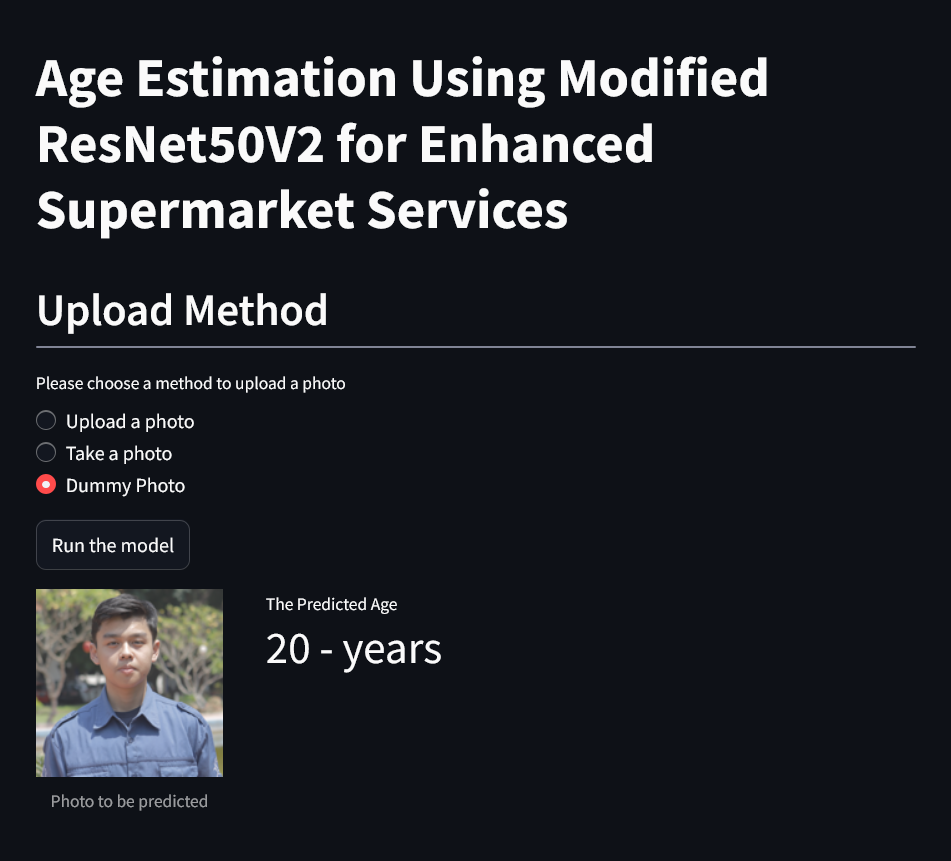

    

        
    

    

        
<b>Age Estimation Using Modified ResNet50V2 for Enhanced Supermarket Services:</b>

        
Modifying and fine-tuning the ResNet model for regression tasks.

    

***

# **About the Project**
## Background and Objectives

Currently, we are working for a supermarket franchise named **Good Seed**. **Good Seed** aims to enhance the quality of its services to grow its business by offering attractive products tailored to the customers' age groups. Therefore, **Good Seed** needs to analyze product purchases within each age group, develop a system that can provide recommendations to customers of specific age groups, and create a system that can monitor employees selling age-restricted products.

Before developing these systems, **Good Seed** will implement a scanning system at the cashier area that can predict the age of customers scanned by the system. Our task is to create a model that can predict the buyer's age based on the scanned photo of the buyer.

Several processes are involved in this project, including:
* Performing feature engineering, such as data augmentation, data normalization, etc.
* Building a machine learning model.
* Deploying the age detection model using `Streamlit`.

## Results Interpretation
The output of this project is a predictive model that can estimate a person's age based on a facial photo. The model can be tested using a web-based application created with `Streamlit`. The deployed model can be accessed via the following link: [Click Here](https://face-age-detection.streamlit.app/)

# **Model Development**
In this project, the ResNet50V2 model is used as the base model for predicting a person's age. The ResNet50V2 model, originally a classification model, is modified in the top layers to work for regression tasks. Two types of top layer architectures were tested to achieve the minimum error, and the following is the best architecture obtained.

ResNet50V2 &rarr; GlobalAvg.Pooling &rarr; Dense(128) &rarr; Dense(16) &rarr; Dense(16) &rarr; Dense(8) &rarr; Dense(1)

With the combination of layer parameters, appropriate learning rate, and regularization constant, this model achieves a MAE score of 6,71 years and 6,85 years when predicting the validation set and testing set, respectively.

# **Model Deployment**
In this project, the trained model can be used via `Streamlit`, which features an attractive and user-friendly interface. The application can accept photo inputs from external directories as well as directly from camera snapshots. The `Streamlit` application can be accessed at [https://face-age-detection.streamlit.app/](https://face-age-detection.streamlit.app/).

Below are screenshots showing how the model in `Streamlit` is used to predict a person's age based on facial photos.

    

